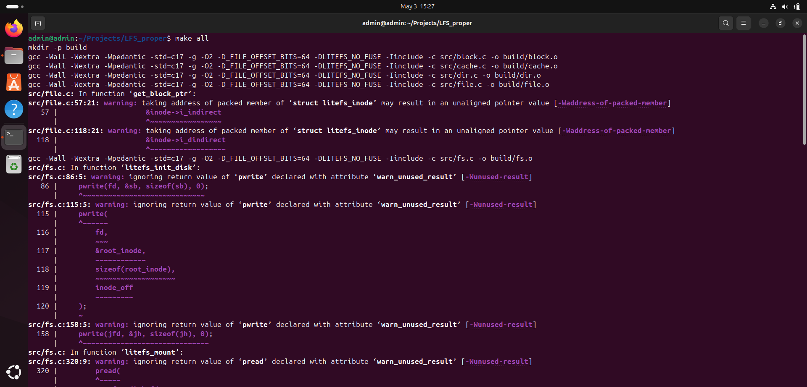
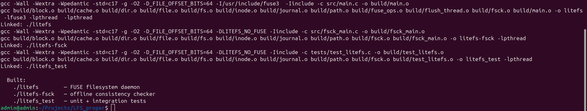
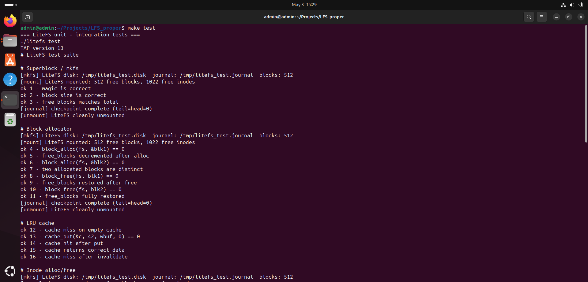
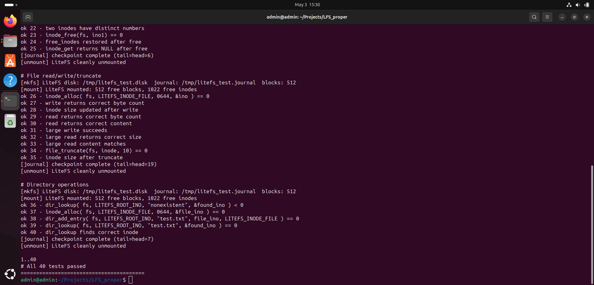
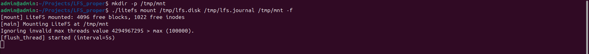

# InodFS — User-Space Filesystem with Journaling & LRU Cache

A production-quality filesystem built from scratch in C using FUSE (Filesystem in Userspace).  
InodFS implements core OS storage concepts — inode management, block allocation, write-ahead  
logging, and an LRU block cache — entirely in user space, mountable on any Linux system.

---

## Features

| Feature | Details |
|---|---|
| **Inode-based storage** | 64-byte inodes with direct + single + double-indirect block pointers (max ~4GB per file) |
| **Block allocator** | First-fit bitmap allocator with persistence across mounts |
| **Write-ahead journal** | Ordered journaling (ext3-style): log → commit → checkpoint |
| **Crash recovery** | Automatic journal replay on dirty mount; uncommitted transactions discarded |
| **LRU block cache** | 64-slot write-back / read-through cache with dirty eviction writeback |
| **Background flush thread** | Periodic checkpoint every 5s bounds data loss window |
| **Directory operations** | mkdir, rmdir, rename, lookup, readdir with linear scan |
| **Symlinks & hard links** | Full POSIX symlink and hard link support |
| **fsck** | 5-pass offline consistency checker with `--fix` repair mode |
| **Test suite** | 67 unit + integration tests (TAP output, no FUSE required) |

---

## Architecture

```text
┌─────────────────────────────────────────┐
│           FUSE VFS Interface            │  ← fuse_ops.c  (getattr, read, write, mkdir ...)
├─────────────────────────────────────────┤
│         Path Resolution Layer           │  ← path.c
├──────────────┬──────────────────────────┤
│  Inode Layer │   Directory Layer        │  ← inode.c / dir.c
├──────────────┴──────────────────────────┤
│         File Data Layer                 │  ← file.c  (direct + indirect block pointers)
├─────────────────────────────────────────┤
│    Block I/O  ←→  LRU Block Cache       │  ← block.c / cache.c
├─────────────────────────────────────────┤
│         Write-Ahead Journal             │  ← journal.c
├─────────────────────────────────────────┤
│         Disk (flat backing file)        │  ← fs.c
└─────────────────────────────────────────┘
```

### Disk Layout

```text
[ Superblock | Inode Table | Block Bitmap | Data Blocks ... ]
    1 block      N blocks      M blocks      up to 8192 blocks
```

### Journal Layout (separate file, circular buffer)

```text
[ Journal Header | DATA slot | DATA slot | COMMIT | DATA slot | ... ]
```

Each write occupies two journal slots: a descriptor header + a full raw data block.  
A transaction is durable only after its COMMIT record is `fdatasync()`'d.

---

## Getting Started

### Prerequisites

```bash
sudo apt install gcc make libfuse3-dev fuse3 pkg-config
```

### Build

```bash
git clone https://github.com/YOUR_USERNAME/inodfs.git
cd inodfs
make all
```





Produces three binaries:

- `./inodfs` — FUSE filesystem daemon
- `./inodfs-fsck` — offline consistency checker
- `./inodfs_test` — unit + integration test runner

---

### Run Tests

```bash
make test
# All 67 tests passed
```





Tests run entirely without FUSE — safe for CI environments.

---

### Format and Mount

```bash
# Create a 16MB filesystem
./inodfs mkfs /tmp/lfs.disk /tmp/lfs.journal 4096
```


```bash
# Mount (Terminal 1 — keep running)
mkdir -p /tmp/mnt
./inodfs mount /tmp/lfs.disk /tmp/lfs.journal /tmp/mnt -f
```



---

### Use It

```bash
# Terminal 2
echo "Hello inodfs" > /tmp/mnt/hello.txt

cat /tmp/mnt/hello.txt

mkdir /tmp/mnt/docs
echo "nested" > /tmp/mnt/docs/note.txt

ls -la /tmp/mnt/

stat /tmp/mnt/hello.txt

df -h /tmp/mnt

# Unmount
fusermount3 -u /tmp/mnt
```

---

### Crash Recovery Demo

```bash
# Write data
echo "must survive" > /tmp/mnt/critical.txt

# Simulate sudden power loss
kill -9 $(pgrep inodfs)

fusermount3 -u /tmp/mnt 2>/dev/null || true

# Remount — journal replay triggers automatically
./inodfs mount /tmp/lfs.disk /tmp/lfs.journal /tmp/mnt -f

# [mount] filesystem was not cleanly unmounted, replaying journal...
# [journal] replayed block 32 (seq=1)
# [journal] replay complete

cat /tmp/mnt/critical.txt
```

---

### Run fsck

```bash
fusermount3 -u /tmp/mnt

./inodfs-fsck /tmp/lfs.disk /tmp/lfs.journal

./inodfs-fsck /tmp/lfs.disk /tmp/lfs.journal --fix
```

---

## Project Structure

```text
inodfs/
├── include/
│   └── inodfs.h          # All types, constants, API declarations
├── src/
│   ├── main.c            # Entry point: mkfs + mount modes
│   ├── fs.c              # Mount/unmount, superblock I/O
│   ├── block.c           # Block alloc/free/read/write + bitmap
│   ├── inode.c           # Inode alloc/free/flush
│   ├── file.c            # File read/write/truncate
│   ├── dir.c             # Directory CRUD
│   ├── path.c            # Path → inode resolution
│   ├── journal.c         # WAL: begin/log/commit/replay/checkpoint
│   ├── cache.c           # LRU block cache (write-back)
│   ├── flush_thread.c    # Background checkpoint thread
│   ├── fuse_ops.c        # FUSE VFS callbacks
│   ├── fsck.c            # 5-pass consistency checker
│   └── fsck_main.c       # fsck entry point
├── tests/
│   └── test_inodfs.c     # 67 unit + integration tests
├── scripts/
│   └── stress_test.sh    # Crash simulation + concurrent write tests
├── screenshots/
│   ├── LFS-1.png
│   ├── LFS-2.png
│   ├── LFS-3.png
│   ├── LFS-4.png
│   ├── LFS-5.png
│   └── LFS-6.png
└── Makefile
```

---

## Key Design Decisions

### Why two journal slots per block write?

Packing a 32-byte header + 4096-byte data block into a single 4096-byte journal slot  
silently truncates 32 bytes from every stored block.

Using two slots (descriptor + raw data) avoids this and makes the journal layout explicit  
and verifiable with CRC32 checksums.

### Why write-back cache with eviction writeback?

Write-through would double disk I/O on every write.

Write-back batches dirty blocks and flushes them at checkpoint. The eviction path writes dirty  
blocks synchronously before reusing the slot, preventing data loss when the cache fills up  
(e.g. writing large files).

### Why a separate journal file?

Keeping the journal separate from the data region simplifies layout arithmetic and avoids  
reserving journal space in the main block bitmap.

---

## Possible Extensions

- Per-inode rwlocks (replace coarse `fs_lock` for concurrency)
- Extent-based block pointers (replace array with B-tree like ext4)
- Transparent LZ4 block compression
- Extended attributes (xattr)
- `fsck` integration into mount (auto-repair on dirty mount)

---

## Interview Reference

### Write Path

```text
fuse_write
  → file_write
  → get_block_ptr (allocates blocks)
  → journal_begin_txn
  → journal_log_block
  → cache_put(dirty=1)
  → journal_commit_txn + fdatasync
  → background cache_flush
  → journal_checkpoint
```

### Crash Recovery

```text
Dirty s_state on mount
  → scan journal from j_tail to j_head
  → replay committed transactions
  → discard uncommitted transactions
  → advance j_tail
  → mark clean
```

### Max File Size

```text
12 × 4KB (direct)
+ 1024 × 4KB (indirect)
+ 1024² × 4KB (double-indirect)
≈ 4GB
```

---

## License

MIT
